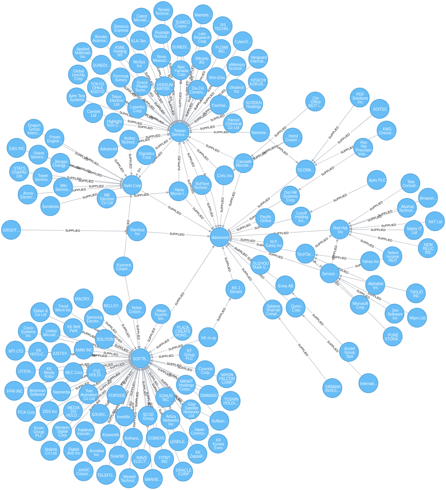

# Start a Neo4j instance using Docker
```shell
docker run \
    --publish=7474:7474 --publish=7687:7687 \
    --volume=/tmp/neo4j/data:/data \
    --volume=/mnt/ext_stor/Revere:/var/lib/neo4j/import \
    --env=NEO4J_dbms_memory_pagecache_size=4G \
    --env=NEO4J_dbms_memory_heap_max__size=8G \
    neo4j:latest
```

# Load data into Neo4j
**N.B.** The data files are stored in the location specified in the docker invocation above. Additionally, the nodes and relationships have been preprocessed.

## Load the nodes
```cypher
USING PERIODIC COMMIT
LOAD CSV WITH HEADERS FROM "file:///companies_recent.csv" AS row
CREATE (:Company {startTime: date(row.start_), endTime: date(row.end_), revId: toInteger(row.id), name: row.name, ticker: row.ticker, investor_contact: row.investor_contact_name, cusip: row.cusip, isin: row.isin});
```

## Create Indexes on some of the node properties
```cypher
create index on :Company(revId);
create index on :Company(ticker);
```

## Load the Relationships
```cypher
USING PERIODIC COMMIT
LOAD CSV WITH HEADERS FROM "file:///rels_start_end.csv" AS row
MATCH (supplier:Company {revId: toInteger(row.supplier_id)})
MATCH (customer:Company {revId: toInteger(row.customer_id)})
MERGE (supplier)-[:SUPPLIED {startTime: date(row.start_), endTime: date(row.end_)}]->(customer);
```

# Query the DB
For example, get the tier one through two supply chain for AMD:
```cypher
MATCH p = (co:Company {ticker: 'AMD-US'})<-[:SUPPLIED*1..2]-(sup:Company)
where ALL(rel in relationships(p) where rel.startTime < date('2017-01-01') and rel.endTime >= date('2017-01-01'))
unwind nodes(p) as n
with p, collect(distinct n) as allNodes
unwind relationships(p) as allRels
return allNodes, allRels
```


